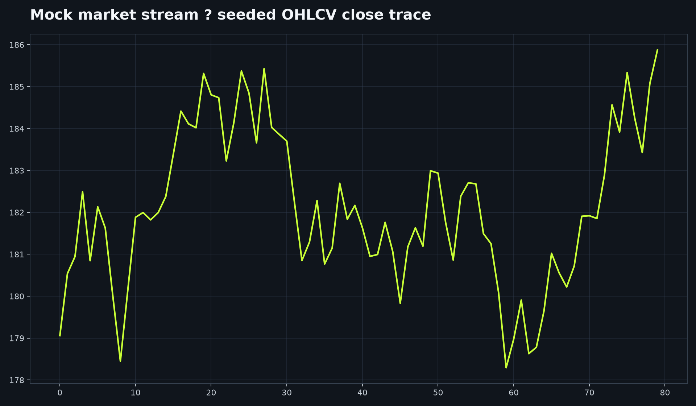

# Real-Time Market Dashboard

[Live dashboard](https://realtime-market-dashboard-kappa.vercel.app)



A React + TypeScript dashboard served by a local yfinance relay. The browser never receives provider credentials.

```bash
npm install
npm run backend
```

In a second terminal:

```bash
npm run dev
npm run lint && npm test && npm run build
```

Open the Vite URL after both processes are running. The dashboard requests current one-minute yfinance bars and updates its stream every 15 seconds. It reads `../.env` only on the local backend when present; a cloned copy can use its own ignored `.env`. yfinance is a polling source, not an exchange-grade tick feed.

## Complete local setup

Install Node.js 20 or later and Python 3.12 or later. In one terminal, create a Python environment if needed, activate it, and install the relay requirements:

```bash
python -m venv .venv
.venv/Scripts/pip install -r backend/requirements.txt
npm run backend
```

In a second terminal run `npm install` once and then `npm run dev`. The client connects to `http://localhost:8000/api/stream/<ticker>` by server-sent events; the browser does not receive credentials. The yfinance path needs no key. If a repository-local `.env` is used, it must remain ignored and contain only server-side variables; the sample file contains names and blanks only.

## Troubleshooting and deployment notes

If the page shows “Relay unavailable,” ensure the backend is running on port 8000 and that the browser can reach it. If a symbol has no current bar, use a valid listed ticker and retry after the provider responds. The frontend alone is static; a public host must also run the Python relay or provide a compatible serverless API. Do not deploy the local `.env` or expose provider keys in `VITE_*` variables. For a public showcase, deploy a credential-free relay that uses yfinance and label it as polling-based data.

## Verification

Run `npm run lint`, `npm test`, and `npm run build`. The test suite checks the normalized live snapshot contract; it intentionally does not call a market-data provider.

This project is intended for educational and research purposes only. It does not provide investment advice, and its outputs should not be used as the sole basis for financial decisions. Historical performance and simulated results do not guarantee future performance.

MIT License. Author: Aarav Shah.
